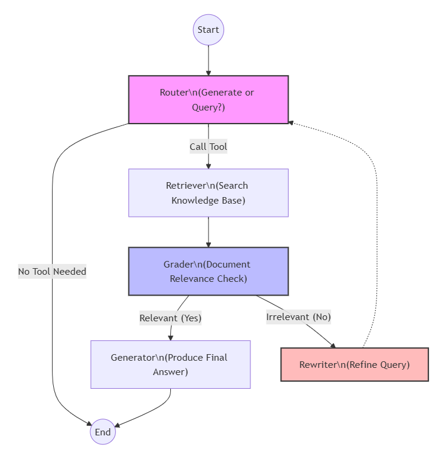

# Hybrid RAG Agent

Production-ready Agentic RAG system with self-correcting retrieval, comprehensive evaluation framework, and LLMOps capabilities.

## Overview

An adaptive RAG agent implementing dynamic routing, retrieval validation, and query rewriting using LangGraph state machines. The system autonomously decides when to retrieve information, evaluates document relevance, and iteratively refines queries until optimal context is obtained.

**Technology Stack**: LangGraph • Google Gemini 2.5 Flash • FastAPI • RAGAS • Docker

## Architecture



**Key Components**:
- **Adaptive Router**: LLM-based tool calling to determine retrieval necessity
- **Document Grader**: Binary relevance evaluation with structured output
- **Query Rewriter**: Automatic query optimization for failed retrievals
- **Citation System**: Chunk-level citation tracking with metadata preservation

## Project Structure

```text
hybird-rag-agent/
├── rag_agent/              # Core RAG system
│   ├── api.py              # FastAPI endpoint with rate limiting
│   ├── config.py           # Configuration management
│   ├── graph_builder.py    # LangGraph workflow + caching
│   ├── nodes.py            # Agent logic nodes
│   ├── tools.py            # Retrieval tool with citations
│   └── vectorstore.py      # Vector store + chunk tracking
│
├── evaluation/             # Comprehensive evaluation framework
│   ├── eval_dataset.json   # 30 curated biomedical queries
│   ├── evaluation.py       # RAGAS + retrieval + performance metrics
│   ├── run_evaluation.py   # Evaluation runner
│   ├── annotate_gold_doc_ids.py  # Interactive annotation tool
│   └── manual_spot_check.py      # Human validation sampling
│
├── docs/                   # Documentation
│   ├── EVALUATION_TUTORIAL.md        # Evaluation guide
│   ├── EVALUATION_METHODOLOGY.md     # Methodology details
│   ├── GOLD_DOC_IDS_GUIDE.md        # Annotation guide
│   ├── LLMOPS_SCORE_CARD.md         # LLMOps maturity assessment
│   └── CACHING_RATELIMIT_IMPLEMENTATION.md
│
├── .github/workflows/      # CI/CD
│   └── evaluation-ci.yml   # Automated regression testing
│
├── Dockerfile              # Production deployment
├── docker-compose.yml      # Container orchestration
└── requirements.txt
```

## Features

### Core Capabilities
- **Agentic RAG**: Autonomous tool calling with LLM-based routing decisions
- **Self-Correction Loop**: Iterative query refinement with document relevance grading
- **Chunk-Level Citations**: Metadata-tracked citations with SOURCE/CHUNK/SNIPPET format
- **Production API**: FastAPI with rate limiting (10 req/min) and async processing

### LLMOps & Evaluation
- **Comprehensive Metrics**: RAGAS (faithfulness, answer relevancy, context precision/recall)
- **Retrieval Hard Metrics**: Hit@k, Recall@k, MRR with gold document tracking
- **System Performance**: p50/p95 latency, token usage, success rate monitoring
- **CI/CD Integration**: Automated evaluation on PR with GitHub Actions
- **Auditability**: Full question/answer/contexts stored for manual spot-checking

### Optimization
- **LLM Response Caching**: InMemoryCache for repeated queries
- **Rate Limiting**: Request throttling with slowapi
- **Debug Tracing**: LangGraph stream visualization for development

## Quick Start

### Prerequisites
- Python 3.10+
- Google AI API Key ([Get free key](https://aistudio.google.com/api-keys))

### Installation

```bash
# Clone repository
git clone <repository-url>
cd hybird-rag-agent

# Create virtual environment
python -m venv .venv
source .venv/bin/activate  # Windows: .venv\Scripts\activate

# Install dependencies
pip install -r requirements.txt

# Set API key
export GOOGLE_API_KEY="your_api_key_here"
# Windows: $env:GOOGLE_API_KEY="your_api_key_here"
```

## Usage

### Production API

```bash
# Start API server
uvicorn rag_agent.api:app --host 0.0.0.0 --port 8000

# Test endpoint
curl -X POST "http://localhost:8000/v1/chat" \
  -H "Content-Type: application/json" \
  -d '{"message": "What is metformin?"}'
```

**Docker Deployment**:
```bash
docker-compose up -d
```

### Interactive CLI

```bash
python -m rag_agent.app
```

### Debug Mode

```bash
# Stream graph execution with intermediate steps
python debug_cli.py
```

### Running Evaluation

```bash
cd evaluation

# Full evaluation (RAGAS + Retrieval + Performance)
python run_evaluation.py

# Annotate gold document IDs for retrieval metrics
python annotate_gold_doc_ids.py

# Manual spot-check (random sample validation)
python manual_spot_check.py --k 5
```

## Evaluation Results

**Dataset**: 30 curated biomedical queries across 6 intent types (definition, mechanism, comparison, process, side effects, clinical application)

### Metrics

| Category | Metric | Score | Industry Benchmark |
|----------|--------|-------|-------------------|
| **RAGAS** | Faithfulness | 0.9505 | >0.90 |
| | Answer Relevancy | 0.7676 | >0.75 |
| | Context Precision | 0.9667 | >0.85 |
| | Context Recall | 0.8556 | >0.80 |
| **Retrieval** | Hit@3 | 0.9630 | >0.90 |
| | Recall@3 | 0.9444 | >0.85 |
| | MRR | 0.7654 | >0.70 |
| **Performance** | p50 Latency | 8.09s | <10s |
| | p95 Latency | 9.49s | <15s |
| | Success Rate | 100% | >95% |

**Validation Method**: 
- RAGAS automated evaluation with Gemini 2.5 Flash as judge (temperature=0)
- Manual spot-check on 5 random samples for human-LLM correlation
- Full question/answer/contexts stored in CSV for auditability

## Agent Workflow

**1. Routing (Autonomy)**:
- LLM uses tool calling to decide: retrieve or answer directly
- Example: "Hello" → Direct response | "What is metformin?" → Retrieve

**2. Retrieval**:
- Similarity search (k=3) with chunk-level metadata
- Citations include: SOURCE, CHUNK ID, SNIPPET, FULL CONTENT

**3. Grading (Proactivity)**:
- Binary relevance evaluation with structured output
- If relevant → Generate answer
- If not relevant → Rewrite query (self-correction loop)

**4. Answer Generation**:
- Context-grounded response with inline citations
- Format: `[CITATION X]` blocks with full provenance

## LLMOps Capabilities

**Current Implementation** (32/100 points, Prototype stage):
- ✅ Evaluation Framework (offline RAGAS + retrieval metrics)
- ✅ Debug Tracing (LangGraph stream logging)
- ✅ Caching (InMemoryCache for LLM responses)
- ✅ Rate Limiting (10 req/min with slowapi)
- ✅ CI/CD (GitHub Actions for automated evaluation)
- ⚠️ Basic Observability (console logs, no structured logging)

**Roadmap**:
- Production Tracing (OpenTelemetry + Jaeger)
- Real-time Monitoring (Prometheus + Grafana)
- Prompt Versioning & A/B Testing
- Advanced Failure Isolation (Circuit Breaker, Retry Logic)

See [`docs/LLMOPS_SCORE_CARD.md`](docs/LLMOPS_SCORE_CARD.md) for detailed analysis.

## Documentation

- **[EVALUATION_TUTORIAL.md](docs/EVALUATION_TUTORIAL.md)**: Complete evaluation guide
- **[EVALUATION_METHODOLOGY.md](docs/EVALUATION_METHODOLOGY.md)**: Metric definitions and validation methods
- **[GOLD_DOC_IDS_GUIDE.md](docs/GOLD_DOC_IDS_GUIDE.md)**: Retrieval metric annotation guide
- **[LLMOPS_SCORE_CARD.md](docs/LLMOPS_SCORE_CARD.md)**: LLMOps maturity assessment

## Data Source Notice

Document base includes URLs verified against `robots.txt` policies. See `assets/` for compliance screenshots. Contact: [zhouhengyu21510@gmail.com](mailto:zhouhengyu21510@gmail.com) for policy concerns.